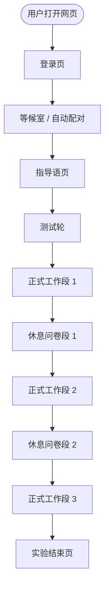
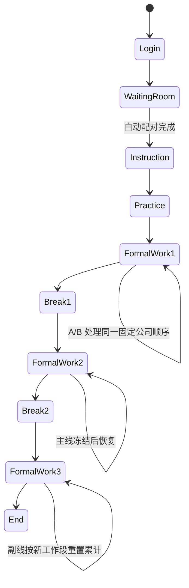

# APP_FLOW.md

> 本文档记录 2026-05-12 后确认的正式实验流程。
> 本轮重点更新：自动角色分配、测试轮、三工作段与两次问卷休息段、A 单公司 5 分钟机制、B 无独立等待页、副线入口重构、AI 按工作段分级。

---

## 1. 总流程

---

## 2. 角色与配对

### 2.1 角色职责

| 角色 | 代号 | 主要职责 |
| --- | --- | --- |
| 上游尽调员 | A | 阅读原始材料、填写尽调表、在 5 分钟窗口结束时提交给 B 的上游信息 |
| 投资经理 | B | 基于自有材料、A 的尽调信息和 AI 辅助完成投资判断 |
| 管理员 | Admin | 上传合格手机号名单、配置实验参数、导出数据 |

### 2.2 自动分配规则

- 管理员不再预设 `A/B`。
- admin 上传的手机号只是“准入令牌”，不是角色分配结果。
- 系统登录时只校验手机号是否在合格名单中。
- 正式实验按真实进入时间戳 / 进入顺序自动分配角色：
  - 第 `1` 个进入者为 `A`
  - 第 `2` 个进入者为 `B`，并与前一个 `A` 配对
  - 第 `3/4` 个进入者组成下一组
- 一组 `A/B` 在整个实验期间保持固定配对关系。
- 角色分配的真源是登录进入顺序，不是 admin 表里的任何角色字段。

---

## 3. 正式实验的时间结构

### 3.1 段结构

正式实验固定为：
- 工作段 1
- 休息问卷段 1
- 工作段 2
- 休息问卷段 2
- 工作段 3

指导语之后先进入测试轮；测试轮不计入上述 3 个正式工作段。

### 3.2 默认时长

- 工作段默认 `20` 分钟
- 休息问卷段默认 `5` 分钟
- A 的单公司处理窗口固定 `5` 分钟

其中工作段时长和休息时长由 admin 全局配置并持久化；A 的单公司 `5` 分钟窗口当前固定。

### 3.3 倒计时显示

- 顶栏必须显示当前阶段倒计时。
- 主工作台、测试轮页、休息问卷页、副线展开页都显示同一个当前阶段倒计时。
- 当 A 正在处理某家公司时，还要额外显示该公司的 `5` 分钟倒计时。

### 3.4 冻结与恢复

- 工作段结束时，主线任务冻结并保存当前状态。
- 下一工作段开始后，主线从冻结点继续，不重置公司进度。
- 如果工作段结束早于 A 的单公司 `5` 分钟，则以工作段结束为优先；下一工作段恢复时继续剩余公司时间。
- 副线任务的已完成累计不跨工作段继承；进入新工作段时清空并重新按该段内容积累。
- 休息问卷段中，被试提交问卷后不应立刻回到主工作台；页面应显示“已提交，等待休息段结束”，倒计时结束后系统再自动进入下一工作段。

---

## 4. 公司顺序与主线规则

### 4.1 公司顺序

- 每组 `A/B` 在 session 开始时一次性生成一条随机、无放回的固定公司顺序。
- `A` 和 `B` 共享同一条公司顺序。
- 这条顺序在该 session 内不再变化。

### 4.2 A 端规则

- A 按固定公司顺序逐家处理。
- A 在每家公司上有 `5` 分钟窗口。
- A 可保存草稿，但不会改变公司流转。
- `5` 分钟到时，系统自动保存，并将该公司的 A 端尽调信息解锁给 B。
- A 完成当前公司后进入下一家公司；若工作段结束，则先冻结。
- 如果工作段在 A 的 5 分钟窗口结束前到点，A 当前公司的剩余秒数必须保存；下一工作段恢复后继续计算，不能直接视为 0 秒。

### 4.3 B 端规则

- B 不再进入独立等待页。
- B 从正式实验开始起就使用统一主工作台。
- A/B 同时拿到同一条公司顺序；B 一开始就分配到当前公司，可以立即阅读 B 自有材料、填写投资判断、使用主线 AI。
- B 的材料区需要额外包含一个固定 tab：`尽调员信息`。
- 在 A 的 `5` 分钟窗口结束前，`尽调员信息` tab 可以点击，但内容显示锁定态，提示“等待 A 反馈”。
- A 信息解锁后，`尽调员信息` tab 显示 A 的尽调反馈。
- B 必须明确打开过 `尽调员信息` tab 一次，提交按钮才可用。
- 在 A 信息未解锁或 B 未查看 `尽调员信息` 前，B 提交按钮保持灰态；hover 提示应说明“等待 A 端反馈”或“请先查看尽调员信息”。
- A 的反馈不应放在 B 的作答区里；B 作答区只放 B 自己的投资判断表。
- A 信息解锁瞬间，系统保存一次 B 端“5分钟快照 + 时间戳”。

---

## 5. 测试轮、休息段与结束

### 5.1 测试轮

- 位于指导语之后、正式实验之前。
- 页面结构先复用正式主工作台。
- 日志、快照、AI 记录与正式轮分离。
- 后续教学细节可再迭代，但当前要先打通独立练习轮。

### 5.2 休息问卷段

- 休息段就是问卷段，当前按单选题问卷实现。
- 进入休息段时冻结主线，不允许继续推进正式任务。
- 被试提交问卷后，当前页进入提交成功 / 等待态。
- 提交成功后刷新页面仍应保持等待态，不能重新显示未提交问卷。
- 休息段结束后自动进入下一工作段。

### 5.3 实验结束

- 三个正式工作段完成后进入结束页。
- 页面显示实验完成提示。
- 后台记录完成时间与阶段完成状态。

---

## 6. 副线任务流

### 6.1 顶部默认态

- 顶部入口固定文案为 `待处理事宜`。
- 不显示具体数量。
- 不显示“市场实时快讯”。
- 不显示详细政策标题或摘要。
- 滚动文案固定为 `您有新事项入库，请尽快处理`。
- 文案从右往左滚动，到达最左端后停留 `5s`，随后在 `2s` 内淡化消失，再等待 `30s` 后重新从右往左滚动。
- 点击“待处理事宜”或滚动消息，都进入副线展开页。

### 6.2 副线展开页

- 复用主工作台结构。
- 左侧为副线材料区。
- 右上为副线题目作答区。
- 右下为副线 AI 聊天区。
- 保留全屏、保存草稿、拖拽分栏等正式工作台能力。
- 选择选项后不自动跳题，通过“上一题 / 下一题”切换。

---

## 7. AI 规则

- AI 等级按工作段 `1/2/3` 配置为 `basic` 或 `advanced`。
- 同一工作段内，主线 AI 与副线 AI 共享同一等级。
- 主线 AI 按公司隔离上下文：切换公司后前端上下文清空，但历史消息要保留到数据库。
- 副线 AI 按“参与者 + 当前实验 + 当前工作段”连续，不因切换公司清空。
- `basic` 不允许图片上传和图片粘贴。
- `advanced` 允许图片能力。

---

## 8. 页面与路由认知

### 8.1 当前主流程页面

- `/login`
- `/waiting-room`
- `/instruction`
- `/practice/*`
- `/workspace/a`
- `/workspace/b`
- `/workspace/b-feedback`
- `/workspace/end`
- `/admin`

### 8.2 关于旧的 `/workspace/b-waiting`

- 旧版独立 B 等待页已从正式流程中移除。
- 如果代码层短期保留该路由，只允许用于兼容跳转，不再作为正式流程节点。

---

## 9. 管理后台职责

- 上传合格手机号名单
- 配置工作段时长
- 配置休息问卷段时长
- 配置工作段 `1/2/3` 的 AI 等级
- 配置问卷模板
- 查看 session、任务状态、日志与导出数据

---

## 10. 状态机摘要

