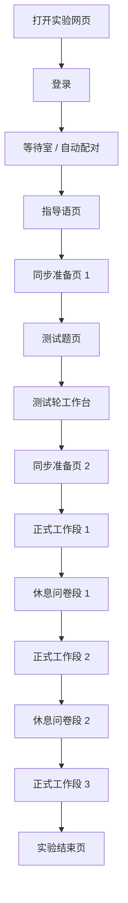
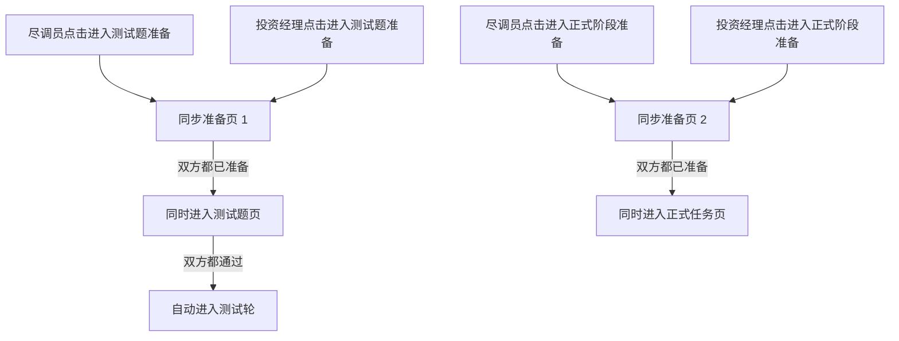
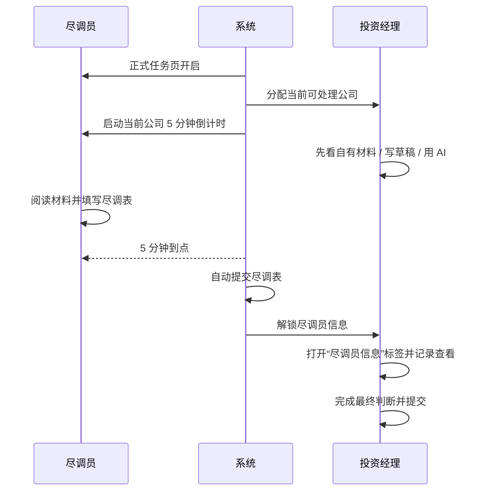
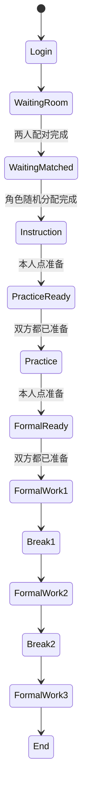

# APP_FLOW.md

> 本文档记录 2026-05-28 后确认的实验主流程。  
> 本轮重点更新：  
> 1. 指导语后先进入同步准备页 1；双方 ready 后进入测试题，双方都通过后自动进入测试轮  
> 2. 测试轮复用正式工作台结构，并在测试轮内完成教学引导  
> 3. 测试轮案例与正式案例在材料库中分层管理  
> 4. 正式任务第一页两端同时起跑，尽调员在 5 分钟到点后自动提交

---

## 1. 总流程



---

## 2. 配对与角色分配

### 2.1 参与者可见角色名称

- `A` 对外显示为 `尽调员`
- `B` 对外显示为 `投资经理`
- 参与者可见页面不能暴露内部 `A/B` 字母

### 2.2 配对规则

- 系统先按进入顺序把两位参与者组成一组
- 第 1 位进入者先进入等待室
- 第 2 位进入者加入后，该组配对完成
- 这一步只决定“谁和谁是一组”，不预先固定角色

### 2.3 角色随机分配规则

- 角色分配发生在“第二位参与者加入、两人配对完成”的那一刻
- 系统生成一枚角色分配 seed
- 系统根据该 seed 做一次二分随机：
  - 一种结果是“先到者=尽调员，后到者=投资经理”
  - 另一种结果是“先到者=投资经理，后到者=尽调员”
- 角色一旦分配完成，该组在整个 session 内不再改变角色

### 2.4 角色随机化留痕

- 数据库必须保存：
  - `roleAssignmentMethod`
  - `roleAssignmentSeed`
  - `roleAssignedAt`
  - 最终谁是尽调员、谁是投资经理
- 等待室只显示“等待随机分配”或最终中文角色名，不显示内部字母

---

## 3. 正式轮公司顺序与分配

### 3.1 基本规则

- 每组 session 在正式任务开始前生成一条固定正式公司顺序
- 同一组内，尽调员和投资经理共享同一批 formal 公司池
- 该顺序在本 session 内保持不变
- 该顺序直接决定尽调员的正式任务推进顺序
- 投资经理共享同一批公司池，但实际取公司采用动态分配而不是机械同步逐家推进
- 不同组之间允许拥有不同顺序

### 3.2 随机化要求

- 正式公司顺序不能使用 `sort(() => Math.random() - 0.5)` 这种不可审计写法
- 需要使用可复现的有 seed 随机化算法
- 当前口径采用：`seeded_fisher_yates_v1`

### 3.3 公司顺序留痕

- 数据库必须保存：
  - `companySequenceMethod`
  - `companySequenceSeed`
  - `companySequenceGeneratedAt`
  - 最终正式公司顺序快照
  - `bAssignmentMethod`
  - `bAssignmentLog`

### 3.4 投资经理 B 的动态分配

- 正式轮里，投资经理 `B` 不要求与尽调员永远同步拿到同一家公司
- 当前代码对 `B` 使用 formal 公司池上的动态分配逻辑
- 分配顺序为：
  1. 先看锁定池：`A 已提交 && B 未完成 && B 未分配`
  2. 若锁定池为空，则 fallback 到 `A 正在处理 && B 未分配` 的 PreA 公司
  3. 两者都没有时，B 才进入空窗
- 如果锁定池内同时有多家公司，系统会按可复现 seed 随机挑选一家公司给 B
- 因此当前真实实现应理解为：
  - `A`：按共享固定正式顺序逐家推进
  - `B`：在共享 formal 公司池之上，按“锁定池优先 + PreA fallback”动态取公司

---

## 4. 同步准备屏障

### 4.1 设计目的

- 保证 A/B 进入测试轮的时间一致
- 保证 A/B 进入正式任务第一页的时间一致
- 保证 A 的首个 5 分钟倒计时与 B 的正式任务起点一致

### 4.2 指导语后的同步准备页

- 参与者读完指导语后，不直接进入测试题
- 参与者先点击“我已阅读”，进入同步准备页 1
- 只有双方都点过准备，系统才从同步准备页 1 放行到测试题页
- 测试题页允许两人各自作答；只有双方都达到通过线，系统才自动启动测试轮

### 4.3 测试轮后的同步准备页

- 参与者完成测试轮后，不直接进入正式任务页
- 参与者点击“结束测试轮，准备进入正式阶段”后，进入同步准备页 2
- 只有自己点过准备，自己才进入同步准备页
- 两人都点完后，系统同时放行进入正式任务页



---

## 5. 段结构与时间

### 5.1 段结构

- 测试轮
- 正式工作段 1
- 休息问卷段 1
- 正式工作段 2
- 休息问卷段 2
- 正式工作段 3

### 5.2 默认时长

- 工作段默认 `20` 分钟
- 休息问卷段默认 `5` 分钟
- 尽调员单家公司处理窗口固定 `5` 分钟

### 5.3 倒计时显示

- 顶栏显示当前阶段剩余时间
- 正式工作段中，尽调员额外显示当前公司剩余 5 分钟倒计时

---

## 6. 正式任务主线

### 6.1 正式任务起点

- 双方完成同步准备页 2 后，系统统一启动正式工作段 1
- 同一时刻：
  - 尽调员进入当前公司
  - 投资经理进入当前公司
  - 尽调员当前公司 5 分钟倒计时启动

### 6.2 尽调员规则

- 按共享公司顺序逐家处理
- 5 分钟内不能提前提交
- 5 分钟到点后系统自动提交
- 自动提交时：
  - 保存当前尽调内容
  - 记录自动提交时间
  - 解锁给投资经理查看
- 工作段先于 5 分钟结束时，优先冻结当前进度；下一个工作段继续剩余时间

### 6.3 投资经理规则

- 不要求与尽调员永远同步拿到同一家公司
- 公司来源按动态池分配：
  - 优先接收已进入锁定池的公司
  - 锁定池为空时，可 fallback 到尽调员正在处理的 PreA 公司
  - 两者都没有时，进入空窗态
- 在尽调员信息解锁前，可以先：
  - 阅读自己材料
  - 填写投资判断草稿
  - 使用主线 AI
- 在尽调员信息解锁后：
  - 可以打开“尽调员信息”标签查看内容
  - 可以直接提交，不再把“是否查看过”作为提交门槛
- 但“是否查看过尽调员信息”仍要记录为实验行为变量

### 6.4 尽调员信息标签规则

- 未解锁时：显示锁定态提示
- 已解锁但未查看时：`尽调员信息` tab 显示为可点击状态，但不再单独弹出过渡页
- 点击 `尽调员信息` tab 后：
  - 记录 `bViewedAInfoAt`
  - 记录对应行为事件
  - 展示真正的尽调内容



---

## 7. 测试轮、休息段与结束

### 7.1 测试轮

- 位于指导语之后、正式实验之前
- 先做测试题，再进入测试轮工作台
- 测试轮工作台内要完成主线与副线教学引导
- 测试轮使用单独的练习案例池；当前本地可回退到 `P01`
- 数据与正式轮分离

### 7.2 休息问卷段

- 进入休息段时冻结主线任务
- 提交问卷后进入等待态，不直接跳回主工作台
- 休息段结束后自动进入下一正式工作段

### 7.3 实验结束

- 三个正式工作段完成后进入结束页
- 系统记录完成时间与最终状态

---

## 8. 副线任务

### 8.1 实验设计概览

副线系统承载两个实验操纵：

1. **提醒频率**（变量 A）：后台题目实际到达统一为每 30s 一道题，区别只在前端滚动提醒的频率——continuous 每道都提醒，batch 攒约 5 分钟提醒一次
2. **叙事组别**（变量 B）：团队看到的副线题是纯中性（neutral_info）还是掺入合作叙事（coop_narrative）

两个变量在 Session 创建时随机决定，整个实验期间不变。同一个 Session 内的 A 和 B 共享同一套副线条件。

```
实验条件（2x2 枚举，团队级）
│
├── 提醒频率: continuous / batch
│   └── 后台题目实际到达统一为每30s一道，区别只是前端提醒频率
│   └── continuous: 每道都提醒 / batch: 攒约5分钟提醒一次
│   └── 3 个工作段保持一致
│
└── 叙事组别: neutral_info / coop_narrative
    └── 若 coop_narrative → 主题顺序随机（6 种排列之一）
        三类主题: 互补分工 / 验证留痕 / 共同责任
        每类主题分配到一个工作段
```

### 8.2 题库结构

题库共 900 条，已按 `workSegment`（工作段）和 `poolType`（池类型）预分好：

```
题库总量: 900 条
│
├── 普通中性池: 360 条
│   ├── 段1: 120 条（workSegment=1）
│   ├── 段2: 120 条（workSegment=2）
│   └── 段3: 120 条（workSegment=3）
│
└── 合作叙事池: 540 条（每段 180 = 3 主题 x 60）
    ├── 段1: 180 条
    │   ├── 互补分工: 60 条
    │   ├── 验证留痕: 60 条
    │   └── 共同责任: 60 条
    ├── 段2: 180 条（同上结构）
    └── 段3: 180 条（同上结构）
```

### 8.3 每团队分配流程

Session 创建时，系统一次性为 3 个工作段各生成 40 条计划（共 120 条 `SideTaskPlan`）。

#### 中性对照组（neutral_info）

每段只从中性池抽 40 条：

```
工作段1                    工作段2                    工作段3
┌───────────────────┐     ┌───────────────────┐     ┌───────────────────┐
│ 中性池(段1) 120条  │     │ 中性池(段2) 120条  │     │ 中性池(段3) 120条  │
│                   │     │                   │     │                   │
│ seeded shuffle    │     │ seeded shuffle    │     │ seeded shuffle    │
│ 取前 40 条        │     │ 取前 40 条        │     │ 取前 40 条        │
└───────────────────┘     └───────────────────┘     └───────────────────┘
        │                         │                         │
        ▼                         ▼                         ▼
   40 条 Plan               40 条 Plan               40 条 Plan
```

每段从自己的 120 条子池里抽，天然不重复。

#### 合作叙事组（coop_narrative）

假设主题顺序 = [验证留痕, 互补分工, 共同责任]：

```
工作段1 (主题=验证留痕)     工作段2 (主题=互补分工)     工作段3 (主题=共同责任)
┌────────────────────┐    ┌────────────────────┐    ┌────────────────────┐
│ 合作池(段1,验证留痕) │    │ 合作池(段2,互补分工) │    │ 合作池(段3,共同责任) │
│ 60 条可选            │    │ 60 条可选            │    │ 60 条可选            │
│ seeded -> 取 20 条   │    │ seeded -> 取 20 条   │    │ seeded -> 取 20 条   │
├────────────────────┤    ├────────────────────┤    ├────────────────────┤
│ 中性池(段1) 120条    │    │ 中性池(段2) 120条    │    │ 中性池(段3) 120条    │
│ seeded -> 取 20 条   │    │ seeded -> 取 20 条   │    │ seeded -> 取 20 条   │
├────────────────────┤    ├────────────────────┤    ├────────────────────┤
│ 合并 40 条           │    │ 合并 40 条           │    │ 合并 40 条           │
│ 洗牌定序 -> Plan     │    │ 洗牌定序 -> Plan     │    │ 洗牌定序 -> Plan     │
└────────────────────┘    └────────────────────┘    └────────────────────┘
```

每段从合作池取 20 + 中性池取 20 = 40 条，合并后洗牌确定出现顺序。

### 8.4 运行时调度

Plan 记录在 Session 创建时就生成了，但 `scheduledAt` 为空。当工作段真正开始时，系统给这 40 条 Plan 打上时间戳。

**关键设计**：后台题目到达速度两种模式一样（每 30s 一道），区别只在前端滚动提醒出现的频率。

```
Continuous（每条提醒）:
时间 ------------------------------------------------>
  提醒  提醒  提醒  提醒  提醒  提醒  ...  提醒
   *     *     *     *     *     *        *
  题1   题2   题3   题4   题5   题6  ...  题40
  每来一道就滚一次，参与者感知"实时来件"

Batch（分批提醒，约每5分钟提醒一次）:
时间 ------------------------------------------------>
  提醒                              提醒
   * *[==========================]   * *[====...
  一次提醒，但队列里已有多道题
  参与者打开后看到"一下来了好几道"
  实际上这些题是过去5分钟内每30s到一道攒出来的
```

### 8.5 前端展示

顶部副线条只做入口提醒，不做具体题面展示：

- 固定文案：`待处理事宜`
- 滚动消息：`您有新事项入库，请尽快处理`
- 文案从右向左滚动，到左端后停留 5s，淡出 2s，间隔 30s 再次出现

副线展开页复用主工作台结构（左材料 + 右上答题 + 右下 AI），支持队列翻页。

### 8.6 全链路总结

```
题库 (900条, 已按段预分)
        |
        v
Session 创建: 随机决定提醒频率 + 叙事组别 + 主题顺序
        |
        v
每段从对应子池 seeded shuffle 抽 40 条 -> 120 条 Plan (一次性生成)
        |
        v
工作段开始 -> 给 40 条 Plan 打 scheduledAt 时间戳
        |
        v
前端 SSE 轮询 -> scheduledAt <= now 的 Plan 进入副线队列
        |
        v
参与者看到并作答 -> 记录 ExposureLog
```

### 8.7 数字总结

| 维度 | 数值 |
|------|------|
| 题库总量 | 900 |
| 每团队使用量 | 120（3 段 x 40） |
| 中性池每段可选 | 120 |
| 合作池每段每主题可选 | 60 |
| 实验条件数 | 4（提醒频率 2 x 叙事组别 2） |
| 合作组主题排列 | 6 种 |

---

## 9. AI 规则

- AI 等级按正式工作段 `1/2/3` 配置为 `basic` 或 `advanced`
- 主线 AI 按公司隔离上下文
- 副线 AI 按“参与者 + 当前实验 + 当前工作段”连续保留上下文
- `basic` 不支持图片
- `advanced` 支持图片

---

## 10. 页面与路由

- `/login`
- `/waiting-room`
- `/instruction`
- `/practice-quiz`
- `/ready`
- `/practice`
- `/workspace/a`
- `/workspace/b`
- `/workspace/b-feedback`
- `/workspace/end`
- `/admin`

---

## 11. 状态机摘要


## 2026-06-17 增补：段前指导语阶段

正式实验流程在三个工作段前增加 `PRE_SEGMENT_INSTRUCTION` runtime 阶段，前端对应 `/pre-segment-instruction`：

```text
测试轮完成
→ formal ready
→ 段 1 前阅读材料
→ 工作段 1
→ 段 1 后问卷
→ 休息
→ 段 2 前阅读材料
→ 工作段 2
→ 段 2 后问卷
→ 休息
→ 段 3 前阅读材料
→ 工作段 3
→ 段 3 后问卷
→ 最终长问卷
→ 完成页
```

阅读材料页强制观看 15 秒，双方都点击继续后才启动对应工作段。该阶段不计入正式工作段时间，也不进入主线 AI 或副线 AI 上下文。
