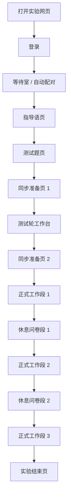
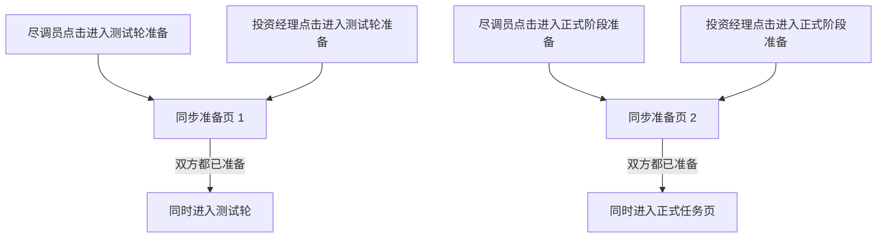
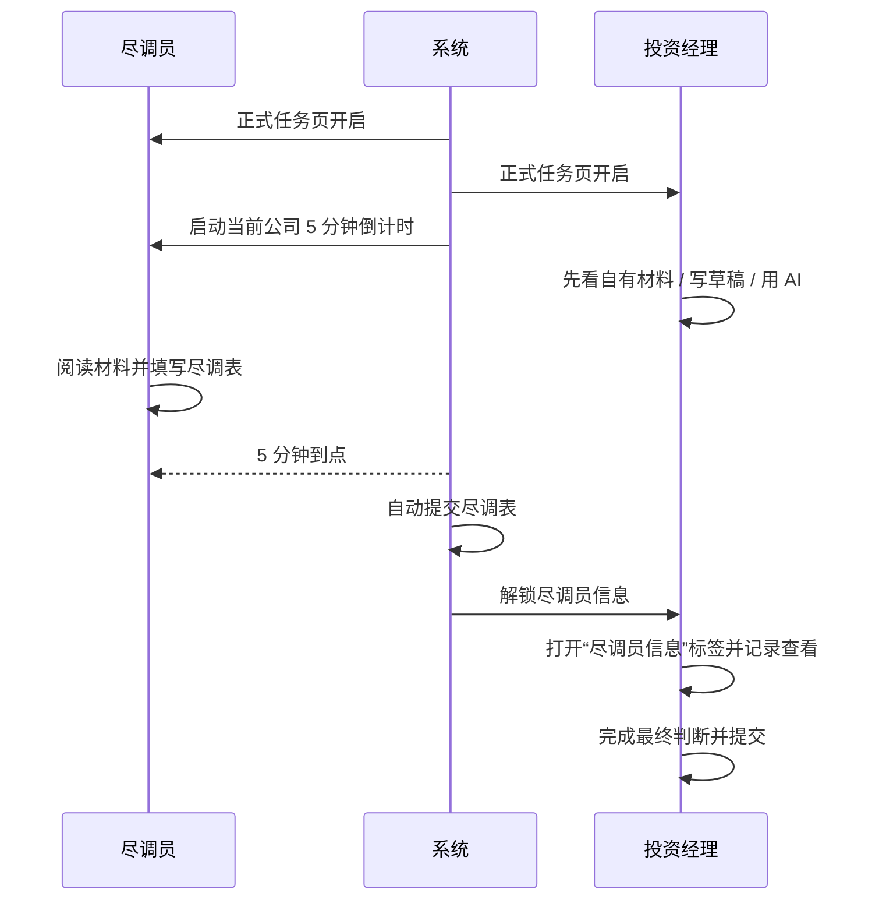
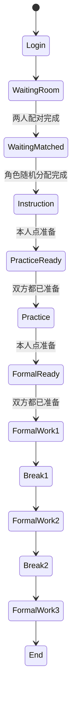

# APP_FLOW.md

> 本文档记录 2026-05-28 后确认的实验主流程。  
> 本轮重点更新：
> 1. 指导语后先进入测试题，通过后再进入测试轮同步准备  
> 2. 测试轮复用正式工作台结构，并在测试轮内完成教学引导  
> 3. 测试轮案例与正式案例在材料库中分层管理  
> 4. 正式任务第一页两端同时起跑，尽调员在 5 分钟到点后自动提交

---

## 1. 总流程

---

## 2. 配对与角色分配

### 2.1 参与者可见角色名称

- `A` 对外显示为 `尽调员`
- `B` 对外显示为 `投资经理`
- 参与者可见页面不能暴露内部 `A/B` 字母

### 2.2 配对规则

- 系统先按进入顺序把两位参与者组成一组
- 第 1 位进入者先进入等待室
- 第 2 位进入者加入后，该组配对完成
- 这一步只决定“谁和谁是一组”，不预先固定角色

### 2.3 角色随机分配规则

- 角色分配发生在“第二位参与者加入、两人配对完成”的那一刻
- 系统生成一枚角色分配 seed
- 系统根据该 seed 做一次二分随机：
  - 一种结果是“先到者=尽调员，后到者=投资经理”
  - 另一种结果是“先到者=投资经理，后到者=尽调员”
- 角色一旦分配完成，该组在整个 session 内不再改变角色

### 2.4 角色随机化留痕

- 数据库必须保存：
  - `roleAssignmentMethod`
  - `roleAssignmentSeed`
  - `roleAssignedAt`
  - 最终谁是尽调员、谁是投资经理
- 等待室只显示“等待随机分配”或最终中文角色名，不显示内部字母

---

## 3. 公司顺序随机化

### 3.1 基本规则

- 每组 session 在正式任务开始前生成一条固定公司顺序
- 同一组内，尽调员和投资经理共享同一条公司顺序
- 该顺序在本 session 内保持不变
- 不同组之间允许拥有不同顺序

### 3.2 随机化要求

- 公司顺序不能使用 `sort(() => Math.random() - 0.5)` 这种不可审计写法
- 需要使用可复现的有 seed 随机化算法
- 当前口径采用：`seeded_fisher_yates_v1`

### 3.3 公司顺序留痕

- 数据库必须保存：
  - `companySequenceMethod`
  - `companySequenceSeed`
  - `companySequenceGeneratedAt`
  - 最终公司顺序快照

---

## 4. 同步准备屏障

### 4.1 设计目的

- 保证 A/B 进入测试轮的时间一致
- 保证 A/B 进入正式任务第一页的时间一致
- 保证 A 的首个 5 分钟倒计时与 B 的正式任务起点一致

### 4.2 指导语后的同步准备页

- 参与者读完指导语后，不直接进入测试轮
- 参与者先进入测试题页
- 测试题达到通过线后，才进入同步准备页 1
- 只有自己点过准备，自己才进入同步准备页
- 两人都点完后，系统同时放行进入测试轮

### 4.3 测试轮后的同步准备页

- 参与者完成测试轮后，不直接进入正式任务页
- 参与者点击“结束测试轮，准备进入正式阶段”后，进入同步准备页 2
- 只有自己点过准备，自己才进入同步准备页
- 两人都点完后，系统同时放行进入正式任务页

---

## 5. 段结构与时间

### 5.1 段结构

- 测试轮
- 正式工作段 1
- 休息问卷段 1
- 正式工作段 2
- 休息问卷段 2
- 正式工作段 3

### 5.2 默认时长

- 工作段默认 `20` 分钟
- 休息问卷段默认 `5` 分钟
- 尽调员单家公司处理窗口固定 `5` 分钟

### 5.3 倒计时显示

- 顶栏显示当前阶段剩余时间
- 正式工作段中，尽调员额外显示当前公司剩余 5 分钟倒计时

---

## 6. 正式任务主线

### 6.1 正式任务起点

- 双方完成同步准备页 2 后，系统统一启动正式工作段 1
- 同一时刻：
  - 尽调员进入当前公司
  - 投资经理进入当前公司
  - 尽调员当前公司 5 分钟倒计时启动

### 6.2 尽调员规则

- 按共享公司顺序逐家处理
- 5 分钟内不能提前提交
- 5 分钟到点后系统自动提交
- 自动提交时：
  - 保存当前尽调内容
  - 记录自动提交时间
  - 解锁给投资经理查看
- 工作段先于 5 分钟结束时，优先冻结当前进度；下一个工作段继续剩余时间

### 6.3 投资经理规则

- 与尽调员同时拿到同一家公司
- 在尽调员信息解锁前，可以先：
  - 阅读自己材料
  - 填写投资判断草稿
  - 使用主线 AI
- 在尽调员信息解锁后：
  - 可以打开“尽调员信息”标签查看内容
  - 可以直接提交，不再把“是否查看过”作为提交门槛
- 但“是否查看过尽调员信息”仍要记录为实验行为变量

### 6.4 尽调员信息标签规则

- 未解锁时：显示锁定态提示
- 已解锁但未查看时：先显示“查看尽调员信息”过渡页
- 点击“查看尽调员信息”后：
  - 记录 `bViewedAInfoAt`
  - 记录对应行为事件
  - 展示真正的尽调内容

---

## 7. 测试轮、休息段与结束

### 7.1 测试轮

- 位于指导语之后、正式实验之前
- 先做测试题，再进入测试轮工作台
- 测试轮工作台内要完成主线与副线教学引导
- 测试轮使用单独的练习案例池；当前本地可回退到 `P01`
- 数据与正式轮分离

### 7.2 休息问卷段

- 进入休息段时冻结主线任务
- 提交问卷后进入等待态，不直接跳回主工作台
- 休息段结束后自动进入下一正式工作段

### 7.3 实验结束

- 三个正式工作段完成后进入结束页
- 系统记录完成时间与最终状态

---

## 8. 副线任务

### 8.1 顶部默认态

- 顶部入口固定文案：`待处理事项`
- 滚动消息固定文案：`您有新事项入队，请尽快处理`
- 文案从右向左滚动，到左端后停留 `5s`
- 随后在 `2s` 内淡出
- 再等待 `30s` 后重新滚动

### 8.2 副线展开页

- 复用主工作台结构
- 左侧是副线材料区
- 右上是副线答题区
- 右下是副线 AI 区

---

## 9. AI 规则

- AI 等级按正式工作段 `1/2/3` 配置为 `basic` 或 `advanced`
- 主线 AI 按公司隔离上下文
- 副线 AI 按“参与者 + 当前实验 + 当前工作段”连续保留上下文
- `basic` 不支持图片
- `advanced` 支持图片

---

## 10. 页面与路由

- `/login`
- `/waiting-room`
- `/instruction`
- `/practice-quiz`
- `/ready`
- `/practice`
- `/workspace/a`
- `/workspace/b`
- `/workspace/b-feedback`
- `/workspace/end`
- `/admin`

---

## 11. 状态机摘要

